# Markdown 完整指南

> Markdown 是一种轻量级标记语言，创始人为约翰·格鲁伯（John Gruber）。它允许人们"使用易读易写的纯文本格式编写文档，然后转换成有效的 XHTML（或者 HTML）文档"。这种语言吸收了很多在电子邮件中已有的纯文本标记的特性。
>
> 由于 Markdown 的轻量化、易读易写特性，并且对于图片、图表、数学式都有支持，当前许多网站都广泛使用 Markdown 来撰写帮助文档或是用于论坛上发表消息。例如：GitHub、Reddit、Diaspora、Stack Exchange、OpenStreetMap、SourceForge 等。甚至 Markdown 能被使用来撰写电子书。
>
> Typora 使用的是 GitHub Flavored Markdown 标准。

---

## 目录

[TOC]

---

## 为什么要整理这篇文章？

- 第一次使用 WordPress（以下简称 WP）建站，发现自带编辑工具太难用了，排版令人发狂，而且发布出来的页面十分丑陋！
- WP 中可以使用的插件，例如：WP-Gruber-Markdown、WP Editor 等，难以令人感到满意，而且对于公式、表格没有很好的支持。
- 关于"Markdown"这篇文章，最初是计划作为公众号（公众号：beanspower）的第一篇文章。奈何微信公众号的文本渲染有与 WP 相似的问题，难以获得满意的排版，一直处于停滞状态。
- 希望它能作为我在互联网整理学习的头作。

---

## 一、目录

目录是每篇文章的骨架，展示了全文的结构思路，需要向读者展示目录时，只要输入 `[TOC]` 即可。

代码如下：

```
[TOC]
```

效果如下：

[TOC]

> 注意：`[TOC]` 语法需要编辑器支持，部分平台可能不支持此功能。

---

## 二、标题

标题是每篇文章都需要也是最常用的格式，在 Markdown 中，如果一段文字被定义为标题，只要在这段文字前加 `#` 号即可。在 Typora 中，只需按快捷键 `Ctrl+1`、`Ctrl+2`……`Ctrl+6`，就可以依次输入一级到六级标题。

代码如下：

```
# 一级标题
## 二级标题
### 三级标题
#### 四级标题
##### 五级标题
###### 六级标题
```

效果如下：


---

## 三、字符格式

### 3.1 加粗

代码如下：

```
**加粗文字**
```

效果如下：

**加粗文字**

### 3.2 斜体

代码如下：

```
*斜体文字*
```

效果如下：

*斜体文字*

### 3.3 加粗斜体

代码如下：

```
***加粗斜体文字***
```

效果如下：

***加粗斜体文字***

### 3.4 下划线

代码如下：

```
<u>下划线文字</u>
```

效果如下：

<u>下划线文字</u>

### 3.5 删除线

代码如下：

```
~~删除线文字~~
```

效果如下：

~~删除线文字~~

### 3.6 高亮

代码如下：

```
==高亮文字==
```

效果如下：

==高亮文字==

> 注意：高亮语法属于扩展语法，并非所有编辑器都支持。

### 3.7 上标

代码如下：

```
文本^上标^
```

效果如下：

文本^上标^

### 3.8 下标

代码如下：

```
文本~下标~
```

效果如下：

文本~下标~

### 3.9 文本居中

代码如下：

```
<center>居中的文字</center>
```

效果如下：

<center>居中的文字</center>

---

## 四、分隔线

在一行中使用三个或更多的 `*`、`-`、`_` 来生成分隔线，符号之间可以有空格。

代码如下：

```
***

---

___
```

效果如下：

***

---

___

> 注意：使用 `-` 时，前后最好空一行，避免被识别为上一级标题的语法。

---

## 五、引用

如果你需要引用一小段别处的句子，那么就要用引用的格式。只需要在文本前加入 `>` 这种尖括号（大于号）即可。在 Typora 中，只需要输入 `>` 之后输入需要的引用内容就可以生成引用块格式。Typora 在随后的输入过程中会自动为你添加 `>` 和行间隔。引用块内的引用也是被允许的，只需要在引用块内同样使用 `>` 即可。

代码如下：

```
> 本文由 beanspower 编辑
```

效果如下：

> 本文由 beanspower 编辑

### 5.1 多级引用

代码如下：

```
> 一级引用
> > 二级引用
> > > 三级引用
```

效果如下：

> 一级引用
> > 二级引用
> > > 三级引用

### 5.2 引用内嵌套其他格式

代码如下：

```
> **加粗引用**
> *斜体引用*
> `代码引用`
```

效果如下：

> **加粗引用**
> *斜体引用*
> `代码引用`

---

## 六、列表

### 6.1 有序列表

指代编号项为数字：1、2、3...

代码如下：

```
1. 内容1
2. 内容2
3. 内容3
```

效果如下：

1. 内容1
2. 内容2
3. 内容3

> 注意：数字后必须有一个空格。

另外，当某些时候有序列表下插入代码块或者其他内容，序号对齐方式可能会不同。可以通过加入 `\` 在 `.` 之前实现不要插入段前缩进。

例如：

```
1\. 内容1
2\. 内容2
3\. 内容3
```

### 6.2 无序列表

指代编号项为符号，可以在列表内容前加上 `+`、`*`、`-` 等（符号和列表内容之间要有一个空格）。

代码如下：

```
- 内容1
* 内容2
+ 内容3
```

效果如下：

- 内容1

- 内容2

- 内容3

### 6.3 任务列表

任务清单是一种特殊的列表，列表中的事项用 `[ ]` 或者 `[x]` 分别标记未完成和已完成，可以通过鼠标点击事项前的任务框，从而切换任务清单事项中的状态。

代码如下：

```
- [ ] 未完成的任务
- [x] 已完成的任务
```

效果如下：

- [ ] 未完成的任务
- [x] 已完成的任务

### 6.4 嵌套列表

通过缩进（2空格或4空格）创建多级列表。

**有序嵌套：**

代码如下：

```
1. 第一项
   1. 嵌套第一项
   2. 嵌套第二项
2. 第二项
```

效果如下：

1. 第一项
   1. 嵌套第一项
   2. 嵌套第二项
2. 第二项

**无序嵌套：**

代码如下：

```
- 第一项
  - 嵌套第一项
  - 嵌套第二项
- 第二项
```

效果如下：

- 第一项
  - 嵌套第一项
  - 嵌套第二项
- 第二项

**混合嵌套：**

代码如下：

```
1. 第一项
   - 嵌套无序项
   - 嵌套无序项
2. 第二项
   1. 嵌套有序项
```

效果如下：

1. 第一项
   - 嵌套无序项
   - 嵌套无序项
2. 第二项
   1. 嵌套有序项

**任务列表嵌套：**

代码如下：

```
- [x] 已完成的任务
  - [x] 子任务1
  - [ ] 子任务2
- [ ] 未完成的任务
```

效果如下：

- [x] 已完成的任务
  - [x] 子任务1
  - [ ] 子任务2
- [ ] 未完成的任务

---

## 七、代码

### 7.1 行内代码

代码如下：

```
`String str1 = "hello";`
```

效果如下：

`String str1 = "hello";`

### 7.2 代码块

Typora 仅仅支持 GFM 的代码块，源码块是不支持的。支持自定义代码块的语言，使用代码块的语法非常简单，输入 ` ```语言类型 ` 然后按下 Enter 就可以，代码输入完毕后，再输入 ` ``` ` 即可。

代码如下：

~~~markdown
```javascript
function hello() {
    console.log("Hello, World!");
}
```
~~~

效果如下：

```javascript
function hello() {
    console.log("Hello, World!");
}
```

**常用语言标识：**

| 语言 | 标识 |
|:---|:---|
| JavaScript | `javascript` 或 `js` |
| Python | `python` 或 `py` |
| Java | `java` |
| C | `c` |
| C++ | `cpp` 或 `c++` |
| HTML | `html` |
| CSS | `css` |
| SQL | `sql` |
| JSON | `json` |
| Shell | `shell` 或 `bash` |
| Markdown | `markdown` 或 `md` |

### 7.3 代码块进阶

**显示行号：**

代码如下：

~~~markdown
```javascript {.line-numbers}
function add(a, b) {
    return a + b;
}
```
~~~

效果如下：
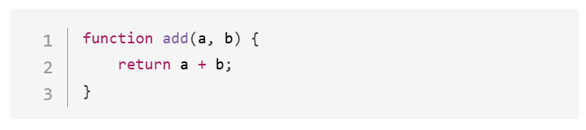

**高亮指定行：**

代码如下：

~~~markdown
```javascript {2,3}
function add(a, b) {
    // 这行会被高亮
    return a + b;  // 这行也会被高亮
}
```
~~~

---

## 八、表格

创建表格，使用快捷键 `Ctrl+T`，或者使用代码。`---:` 表示右对齐，`:---` 表示左对齐，`:---:` 表示居中对齐。

代码如下：

```
| 学科 | 姓名 | 成绩 |
| ---: | :--- | :--: |
| 语文 | 小明 | A |
| 数学 | 小红 | B |
| 英语 | 小猪 | C |
```

效果如下：

| 学科 | 姓名 | 成绩 |
| ---: | :--- | :--: |
| 语文 | 小明 | A |
| 数学 | 小红 | B |
| 英语 | 小猪 | C |

---

## 九、图片

### 9.1 本地图片

代码如下：

```

```

> 注意：路径建议使用正斜杠 `/`，兼容性更好。

### 9.2 网络图片

代码如下：

```

```

效果如下：


### 9.3 带 title 的图片

鼠标悬停时显示提示文字。

代码如下：

```

```

效果如下：


### 9.4 调整图片尺寸

代码如下：

```


或


```

效果如下：


### 9.5 图片链接

点击图片跳转到指定链接。

代码如下：

```
[](https://www.baidu.com)
```

效果如下：

[](https://www.baidu.com)

### 9.6 图片对齐

代码如下：

```
<div align="center">
  
  <p>图片居中显示</p>
</div>
```

效果如下：

<div align="center">
  
  <p>图片居中显示</p>
</div>

---

## 十、链接

### 10.1 行内链接

代码如下：

```
[百度](https://www.baidu.com)
```

效果如下：

[百度](https://www.baidu.com)

### 10.2 引用式链接

适合长文档，链接集中管理，正文更简洁。

代码如下：

```
访问 [Google][google] 或 [百度][baidu] 搜索资料。

[google]: https://www.google.com
[baidu]: https://www.baidu.com
```

效果如下：

访问 [Google][google] 或 [百度][baidu] 搜索资料。

[google]: https://www.google.com
[baidu]: https://www.baidu.com

### 10.3 自动链接

URL 或邮箱直接转为可点击链接。

代码如下：

```
<https://www.baidu.com>

<example@email.com>
```

效果如下：

[https://www.baidu.com](https://www.baidu.com)

[example@email.com](mailto:example@email.com)

### 10.4 锚点链接

链接到文档内的标题。

代码如下：

```
[跳转到目录章节](#目录)
```

效果如下：

[跳转到目录章节](#目录)

> 规则：将标题转为小写，空格替换为 `-`，去除特殊字符。

---

## 十一、表情符号

代码如下：

```
:smile: :heart: :woman: :cry:
```

效果如下：

:smile: :heart: :woman: :cry:

> 更多表情符号可参考：[emoji-cheat-sheet](https://www.webfx.com/tools/emoji-cheat-sheet/)

---

## 十二、键盘按键

使用 `<kbd>` 标签可以模拟键盘按键样式，常用于展示快捷键。

代码如下：

```
<kbd>Ctrl</kbd> + <kbd>C</kbd> 复制
<kbd>Ctrl</kbd> + <kbd>V</kbd> 粘贴
```

效果如下：

<kbd>Ctrl</kbd> + <kbd>C</kbd> 复制

<kbd>Ctrl</kbd> + <kbd>V</kbd> 粘贴

结合任务列表：

代码如下：

```
- [ ] <kbd>吃饭</kbd>
- [ ] <kbd>睡觉</kbd>
- [ ] <kbd>打豆豆</kbd>
```

效果如下：

- [ ] <kbd>吃饭</kbd>
- [ ] <kbd>睡觉</kbd>
- [ ] <kbd>打豆豆</kbd>

---

## 十三、转义字符

Markdown 使用反斜杠 `\` 来转义特殊字符，使其显示为字面量。

代码如下：

```
\* 不是斜体 \*
\# 不是标题
\` 不是代码
\[ 不是链接
```

效果如下：

\* 不是斜体 \*

\# 不是标题

\` 不是代码

\[ 不是链接

**可转义的字符列表：**

| 字符 | 名称 |
|:---:|:---|
| \\ | 反斜杠 |
| \` | 反引号 |
| \* | 星号 |
| \_ | 下划线 |
| \{ \} | 花括号 |
| \[ \] | 方括号 |
| \( \) | 圆括号 |
| \# | 井号 |
| \+ | 加号 |
| \- | 减号 |
| \. | 英文句号 |
| \! | 感叹号 |
| \| | 竖线 |

---

## 十四、脚注

脚注用于在文档末尾添加注释或引用说明。

代码如下：

```
这是一个脚注的例子[^1]，可以用于添加补充说明。

[^1]: 这里是脚注的内容，支持多行文本。
```

效果如下：

这是一个脚注的例子[^1]，可以用于添加补充说明。

[^1]: 这里是脚注的内容，支持多行文本。

> 点击脚注标记可跳转到文档末尾查看详细内容。

---

## 十五、HTML 注释

注释内容不会在渲染结果中显示，适合添加笔记或临时隐藏内容。

代码如下：

```
<!-- 这是一个注释，读者看不到 -->

这里是可见内容。

<!--
  多行注释示例
  可以隐藏大段内容
-->
```

效果如下：

<!-- 这是一个注释，读者看不到 -->

这里是可见内容。

---

## 十六、数学公式

Markdown 可以使用 KaTeX 或 MathJax 来渲染数学表达式。

### 16.1 行内公式

使用单个 `$` 包裹。

代码如下：

```
质能方程 $E=mc^2$ 是物理学中最著名的公式之一。
```

效果如下：

质能方程 $E=mc^2$ 是物理学中最著名的公式之一。

### 16.2 块级公式

使用双 `$$` 包裹。

代码如下：

```
$$
\sum_{i=1}^{n} x_i = x_1 + x_2 + \cdots + x_n
$$
```

效果如下：
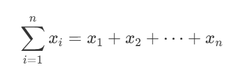

### 16.3 常用公式示例

**分数：**

代码：`$\frac{a}{b}$`

效果：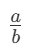

**根号：**

代码：`$\sqrt{x}$ 或 $\sqrt[n]{x}$`

效果：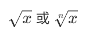

**上下标：**

代码：`$x^2$ 和 $x_i$`

效果：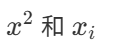
**矩阵：**

代码如下：

```
$$
\begin{bmatrix}
a & b \\
c & d
\end{bmatrix}
$$
```

效果如下：
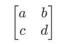

**方程组：**

代码如下：

```
$$
\begin{cases}
x + y = 1 \\
x - y = 0
\end{cases}
$$
```

效果如下：
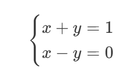

---

## 十七、流程图

使用 Mermaid 语法可以绘制各种图表。

### 17.1 流程图

代码如下：

~~~markdown
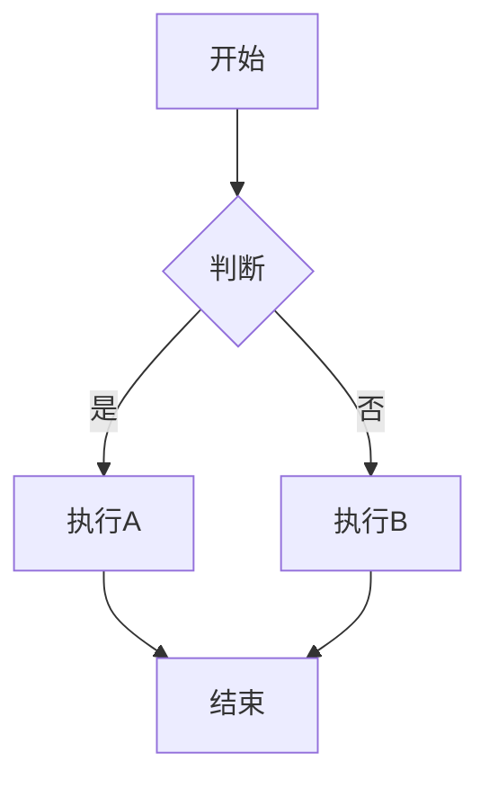
~~~

效果如下：
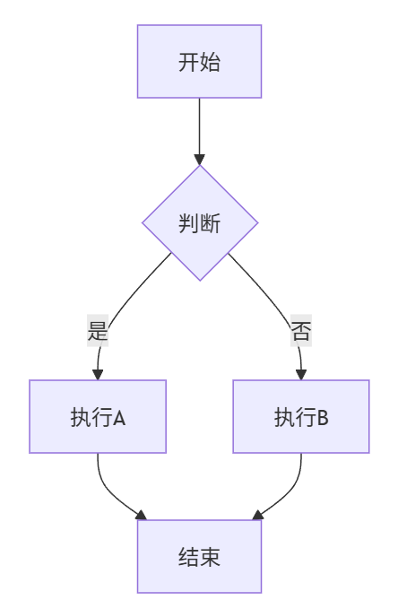

**节点形状：**

| 语法 | 形状 |
|:---|:---|
| `A[矩形]` | 矩形 |
| `A(圆角矩形)` | 圆角矩形 |
| `A((圆形))` | 圆形 |
| `A{菱形}` | 菱形 |
| `A[[子程序]]` | 子程序 |
| `A[(数据库)]` | 数据库 |

**方向：**

| 语法 | 方向 |
|:---|:---|
| `TB` 或 `TD` | 从上到下 |
| `BT` | 从下到上 |
| `LR` | 从左到右 |
| `RL` | 从右到左 |

### 17.2 时序图

代码如下：

~~~markdown
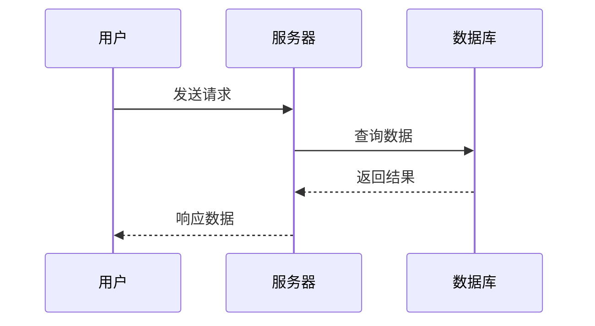
~~~

效果如下：
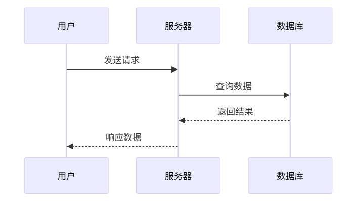

### 17.3 饼图

代码如下：

~~~markdown
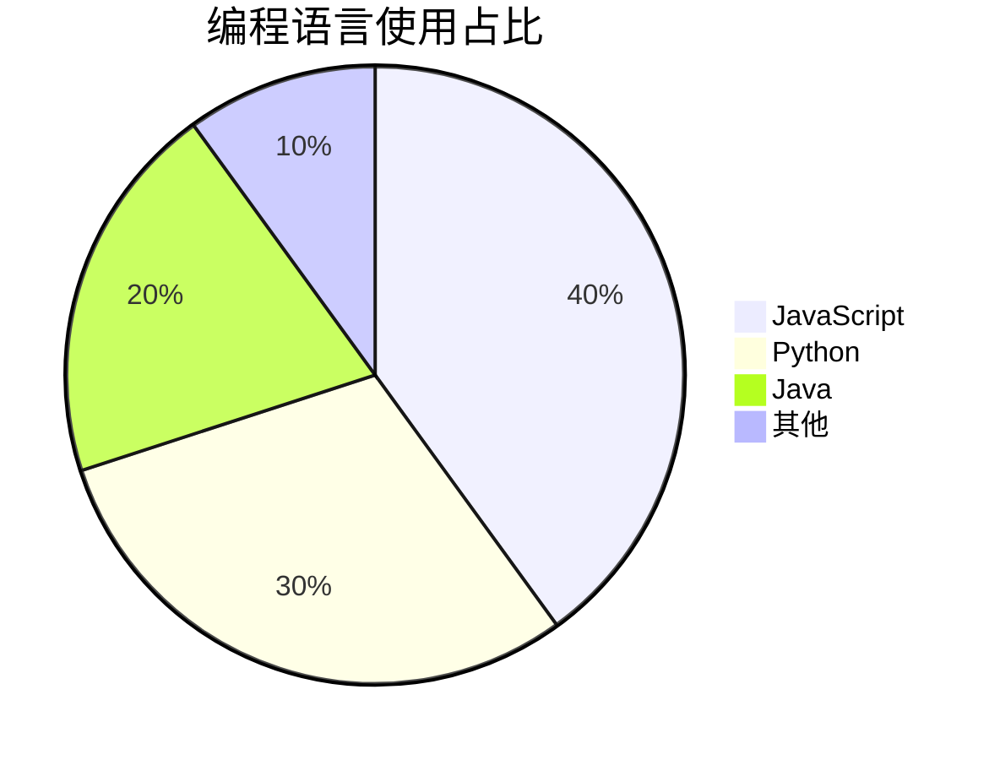
~~~

效果如下：
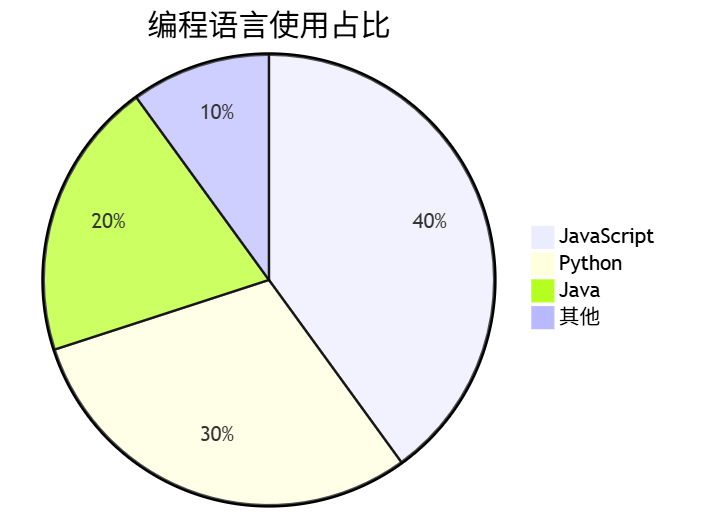

---

## 十八、Typora 快捷键汇总

| 功能 | 快捷键 |
|:---|:---|
| 一级标题 | `Ctrl + 1` |
| 二级标题 | `Ctrl + 2` |
| 三级标题 | `Ctrl + 3` |
| 四级标题 | `Ctrl + 4` |
| 五级标题 | `Ctrl + 5` |
| 六级标题 | `Ctrl + 6` |
| 段落 | `Ctrl + 0` |
| 加粗 | `Ctrl + B` |
| 斜体 | `Ctrl + I` |
| 下划线 | `Ctrl + U` |
| 删除线 | `Alt + Shift + 5` |
| 插入链接 | `Ctrl + K` |
| 插入图片 | `Ctrl + Shift + I` |
| 插入代码块 | `Ctrl + Shift + K` |
| 插入公式块 | `Ctrl + Shift + M` |
| 插入表格 | `Ctrl + T` |
| 引用 | `Ctrl + Shift + Q` |
| 有序列表 | `Ctrl + Shift + [` |
| 无序列表 | `Ctrl + Shift + ]` |
| 查找 | `Ctrl + F` |
| 替换 | `Ctrl + H` |
| 源代码模式 | `Ctrl + /` |
| 专注模式 | `F8` |
| 打字机模式 | `F9` |
| 大纲视图 | `Ctrl + Shift + 1` |
| 文件列表 | `Ctrl + Shift + 2` |

---

## 十九、VS Code Snippets 配置

当使用 VS Code 进行编辑时，可以通过 Snippets 快速完成文档模板的撰写。

通过导入自己 DIY 的 json 脚本：

```json
{
    "Content": {
        "scope": "markdown",
        "prefix": "toc",
        "body": [
            "# 目录 { ignore } $1",
            "[TOC] "
        ],
        "description": "Add content to the document"
    },
    "Ignore": {
        "scope": "markdown",
        "prefix": "ign",
        "body": [
            "{ ignore }"
        ],
        "description": "Ignore some text when generate content"
    }
}
```

> 注意：默认情况下，Markdown 的智能提示是被关闭的，因此需要去 Settings.json 激活该功能。

```json
"[markdown]": {
    "editor.wordWrap": "on",
    "editor.quickSuggestions": true
}
```

---

## 参考

1. [Markdown Preview Enhanced](https://shd101wyy.github.io/markdown-preview-enhanced/#/zh-cn/diagrams)
2. [Markdown Guide](https://www.markdownguide.org/)
3. [Mermaid 文档](https://mermaid.js.org/)
4. [KaTeX 支持的函数](https://katex.org/docs/supported.html)
5. [Typora 官方文档](https://support.typora.io/)
6. [Markdown 中文文档](https://markdown-zh.readthedocs.io/en/latest/)
